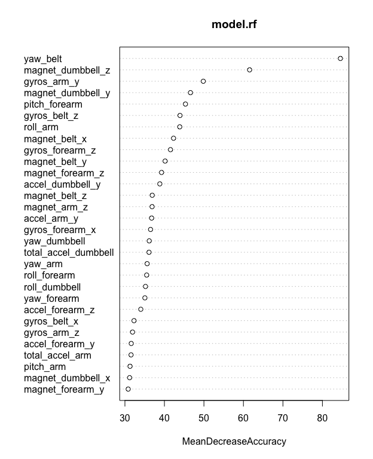
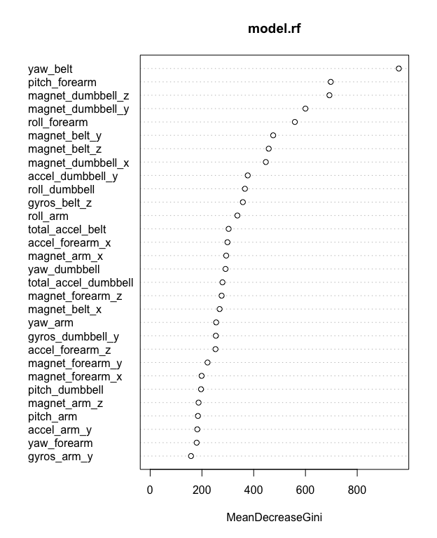

# Human Activity Recognition
E.N.  
October 2015  


  
## Summary
In this project, we use data from accelerometers on the belt, forearm, arm, and dumbell of 6 participants. The participants
were asked to perform barbell lifts correctly and incorrectly in 5 different ways. In order to quantify how well people perform exercises
a model is built to predict in which manner the participants did the exercise.
The data in this report uses the HAR Dataset for benchmarking from http://groupware.les.inf.puc-rio.br/har

This reports describes how the model was built, how cross validation was used, the expected out of sample error, and a justification for the choices made. 


## Preparation

### Loading


First we read a small chunk of data (code not shown). This reveals some mising data, identified by `NA`, `"#DIV/0!"` or just `""` (empty strings),
this shows partly because columns are identified as having type character. After dealing with this, next we can observe logical columns; they are
not, it's just that every entry is `NA`. These columns can be discarded immediately.  


```r
# Load the data
df	<- read.csv(har_data, header=TRUE, sep=",", na.strings=c("NA","#DIV/0!",""), stringsAsFactors = FALSE)

classes <- sapply(df, class)
logis	<- which(classes=="logical")
sum(colSums(is.na(df[,logis])) == nrow(df)) == length(logis)	# just to verify
```

```
## [1] TRUE
```

```r
df	<- select(df, -one_of(names(logis)))
dim(df)
```

```
## [1] 19622   154
```
The dataset now contains 19622 observations and there are 154 variables.
Since we are interested in `classe` as an outcome, that leaves 153 variables to explore. 


### Clean up
There is still a lot of data missing; if a large majority of values are missing for a predictor (variable, column) it wil not
be relevant for the prediction. With a threshold of say 80 % of the observations missing we drop these variables; this means
94 variables less. Also, the first seven variables 
("X", "user_name", "raw_timestamp_part_1", "raw_timestamp_part_2", "cvtd_timestamp", "new_window" and "num_window")
are not (accelerometers) measurements from which to predict how the exercise was done, so they can be dropped as well.

```r
df	<- select(df, -which(colSums(is.na(df)) >= .8 * nrow(df)) )
df	<- select(df, -(1:7))
df	<- mutate(df, classe=factor(classe))	# make models use classification if needed
dim(df)
```

```
## [1] 19622    53
```
Excluding `classe`, that leaves now 52 variables. 


Models may benefit from reducing the level of correlation between the predictors. Given a correlation matrix,
the `findCorrelation` function can be used to find predictors for removal.

```r
m.cor	<- (df[,-ncol(df)])	# remove last (the outcome)
high.cor<- findCorrelation(cor(m.cor), cutoff = .8)
df	<- df[,-high.cor]
```
Excluding `classe`, that leaves now 39 variables for prediction. 


### Preparing & Splitting
The data set will be divided in a training set and test set, 75% and 25 % respectively.

```r
set.seed(201510)

in_train	<- createDataPartition(y=df$classe, p=3/4, list=FALSE)
train.set	<- df[in_train, ]
test.set	<- df[-in_train, ]
```

This gives a training set of 14718 observations and a test set of 4904 observations.


## Analysis

### Model description
As the prediction concerns a classificaition, there are a number of models to choose from, like
"classification trees", "randowm forest" or "support vector machines".
(see also for example http://topepo.github.io/caret/modelList.html)
Random forsests are populare because they are accurate, so let's start with that.
(and if accurate enough, trying others is less necessary).


```r
redo		<- FALSE
mname		<- "model_rf.RDS"
predictors	<- train.set[,-ncol(train.set)]
response	<- train.set$classe

if ( !file.exists(mname) || redo ) {
	model.rf	<- randomForest(x=predictors, y=response, importance=TRUE)
	saveRDS(model.rf, file=mname)
} else {
	model.rf	<- readRDS(mname)
}
model.rf
```

```
## 
## Call:
##  randomForest(x = predictors, y = response, importance = TRUE) 
##                Type of random forest: classification
##                      Number of trees: 500
## No. of variables tried at each split: 6
## 
##         OOB estimate of  error rate: 0.6%
## Confusion matrix:
##      A    B    C    D    E  class.error
## A 4182    2    0    0    1 0.0007168459
## B   11 2831    6    0    0 0.0059691011
## C    0   23 2542    1    1 0.0097389949
## D    0    0   34 2376    2 0.0149253731
## E    0    0    1    7 2698 0.0029563932
```
The out-of-bag (oob) error estimate equals 0.006047, or 
0.6 % (calculated internally, so no
separate cross validation needed with random forests [http://www.stat.berkeley.edu/~breiman/RandomForests/cc_home.htm#ooberr]).


### Prediction

```r
prediction	<- predict( model.rf, newdata=test.set)
table(prediction, test.set$classe)
```

```
##           
## prediction    A    B    C    D    E
##          A 1394    2    0    0    0
##          B    1  946    5    0    0
##          C    0    1  850    6    1
##          D    0    0    0  796    0
##          E    0    0    0    2  900
```

```r
model.rf.cm	<- confusionMatrix(prediction, test.set$classe)
model.rf.cm
```

```
## Confusion Matrix and Statistics
## 
##           Reference
## Prediction    A    B    C    D    E
##          A 1394    2    0    0    0
##          B    1  946    5    0    0
##          C    0    1  850    6    1
##          D    0    0    0  796    0
##          E    0    0    0    2  900
## 
## Overall Statistics
##                                           
##                Accuracy : 0.9963          
##                  95% CI : (0.9942, 0.9978)
##     No Information Rate : 0.2845          
##     P-Value [Acc > NIR] : < 2.2e-16       
##                                           
##                   Kappa : 0.9954          
##  Mcnemar's Test P-Value : NA              
## 
## Statistics by Class:
## 
##                      Class: A Class: B Class: C Class: D Class: E
## Sensitivity            0.9993   0.9968   0.9942   0.9900   0.9989
## Specificity            0.9994   0.9985   0.9980   1.0000   0.9995
## Pos Pred Value         0.9986   0.9937   0.9907   1.0000   0.9978
## Neg Pred Value         0.9997   0.9992   0.9988   0.9981   0.9998
## Prevalence             0.2845   0.1935   0.1743   0.1639   0.1837
## Detection Rate         0.2843   0.1929   0.1733   0.1623   0.1835
## Detection Prevalence   0.2847   0.1941   0.1750   0.1623   0.1839
## Balanced Accuracy      0.9994   0.9977   0.9961   0.9950   0.9992
```

The random forest model create gives us an overall accuracy of 0.9963295
or 99.63 %, which looks accurate enough. 


In Appendix A are two dotcharts of variable importance as measured by the random forest model.


\pagebreak

# Appendix A

## Random forest variables importance





\pagebreak

# Appendix B


## Software environment
Some information about the environment where this document is executed.

```r
sessionInfo()
```

```
## R version 3.2.2 (2015-08-14)
## Platform: x86_64-apple-darwin12.6.0 (64-bit)
## Running under: OS X 10.8.5 (Mountain Lion)
## 
## locale:
## [1] en_GB.UTF-8/en_GB.UTF-8/en_GB.UTF-8/C/en_GB.UTF-8/en_GB.UTF-8
## 
## attached base packages:
## [1] stats4    grid      stats     graphics  grDevices utils     datasets 
## [8] methods   base     
## 
## other attached packages:
##  [1] partykit_1.0-4      party_1.0-23        strucchange_1.5-1  
##  [4] sandwich_2.3-4      zoo_1.7-12          modeltools_0.2-21  
##  [7] mvtnorm_1.0-3       rpart.plot_1.5.3    rpart_4.1-10       
## [10] tree_1.0-36         randomForest_4.6-12 caret_6.0-52       
## [13] lattice_0.20-33     car_2.1-0           RColorBrewer_1.1-2 
## [16] gridExtra_2.0.0     GGally_0.5.0        ggthemes_2.2.1     
## [19] ggplot2_1.0.1       tufterhandout_1.2.1 rmarkdown_0.8      
## [22] xtable_1.7-4        data.table_1.9.6    purrr_0.1.0        
## [25] dplyr_0.4.3         reshape2_1.4.1      lubridate_1.3.3    
## [28] knitcitations_1.0.6 kfigr_1.2           knitr_1.11         
## 
## loaded via a namespace (and not attached):
##  [1] httr_1.0.0          splines_3.2.2       foreach_1.4.2      
##  [4] gtools_3.5.0        assertthat_0.1      coin_1.1-0         
##  [7] yaml_2.1.13         quantreg_5.19       chron_2.3-47       
## [10] digest_0.6.8        RefManageR_0.8.63   minqa_1.2.4        
## [13] colorspace_1.2-6    htmltools_0.2.6     Matrix_1.2-2       
## [16] plyr_1.8.3          XML_3.98-1.3        bibtex_0.4.0       
## [19] BradleyTerry2_1.0-6 SparseM_1.7         scales_0.3.0       
## [22] brglm_0.5-9         lme4_1.1-10         MatrixModels_0.4-1 
## [25] mgcv_1.8-7          TH.data_1.0-6       lazyeval_0.1.10    
## [28] nnet_7.3-10         pbkrtest_0.4-2      proto_0.3-10       
## [31] survival_2.38-3     RJSONIO_1.3-0       magrittr_1.5       
## [34] memoise_0.2.1       evaluate_0.8        nlme_3.1-121       
## [37] MASS_7.3-43         tools_3.2.2         multcomp_1.4-1     
## [40] formatR_1.2.1       stringr_1.0.0       munsell_0.4.2      
## [43] RCurl_1.95-4.7      nloptr_1.0.4        iterators_1.0.7    
## [46] bitops_1.0-6        gtable_0.1.2        codetools_0.2-14   
## [49] DBI_0.3.1           reshape_0.8.5       R6_2.1.1           
## [52] stringi_0.5-5       parallel_3.2.2      Rcpp_0.12.1
```

## Post processing
Used to reference variables defined later on. After http://stackoverflow.com/questions/23570718/creating-summaries-at-the-top-of-a-knitr-report-that-use-variables-that-are-defi


In order to print the values of these variables in place, i.e. ahead of definition, use brew markup: <%= variable %> .


```r
require(knitr, quietly = TRUE)
knit_hooks$set(document=function(x){
                        x1 <- paste(x, collapse = '\n')
                        paste(capture.output(brew::brew(text = x1)), collapse = '\n')
                        }
               )
```

